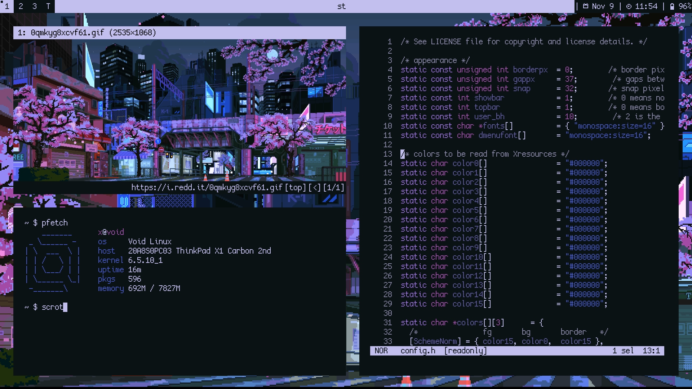

# Suckless software

There are dots for suckless software (dwm, st, dmenu). To use this dots you first should apply patches. The patches I use can be found [here](https://h05t.xyz/x/sl).

# Font

Font used is [Cozette](https://github.com/slavfox/Cozette) (High DPI version).

# Wallpaper

Wallpaper was taken from Reddit. The author's name is [waneella](https://www.waneella.com/).

# Programs

- `dwm`
- `st`
- `dmenu`
- `qutebrowser`
- `feh`
- `pywal`

# Screenshots

